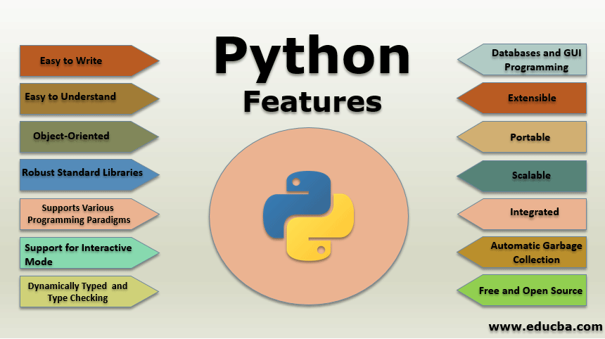

## Class 1
In this we will learn following things 
#### - What are the learning objectives?
#### - Introduction to Python
**What are the learning objectives?**

1. Introduction to Python
1. Core Python
2. OOP in Python
3. Numpy, Pandas and Matplotlib with Python
4. Introduction to Machine Learning
5. Supervised Machine Learning
6.  Unsupervised Machine Learning

#### Lets Start
### 1. Introduction to Python
**What is python?**
Python is an interpreted, object-oriented, high-level programming language with dynamic semantics.
Python is relatively simple so easy to learn.

**History of Python**
Guido Van Rossum Created Python.
It was created from ABC a programming language.
It was started as hobby project.
Its name is taken from BBC’s popular show Monty Python’s Flying Circus

**Features of Python**

It is the reason of selecting python for the course.

**Getting Started**

1. Download [Python](https://www.python.org/downloads/) & Install it
2. Install any text editor of your choice i will be using VScode you can download and install it from [here](https://code.visualstudio.com/)

This is it for first day catch you in the next class